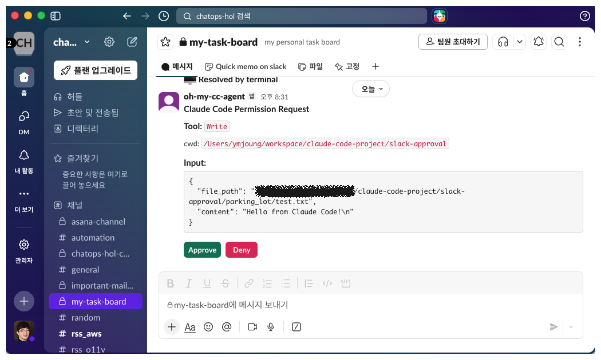
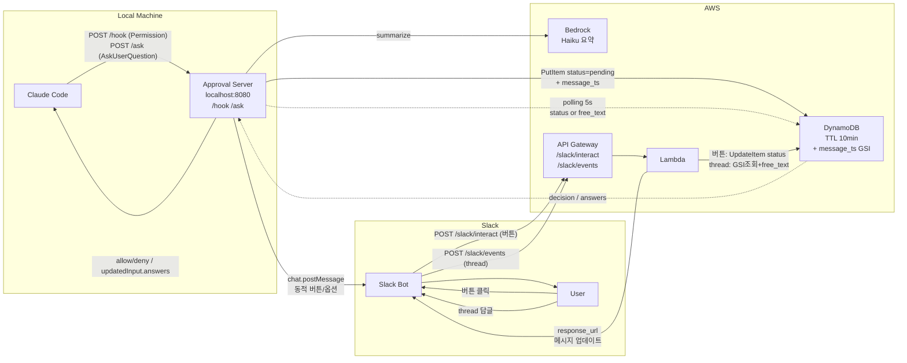
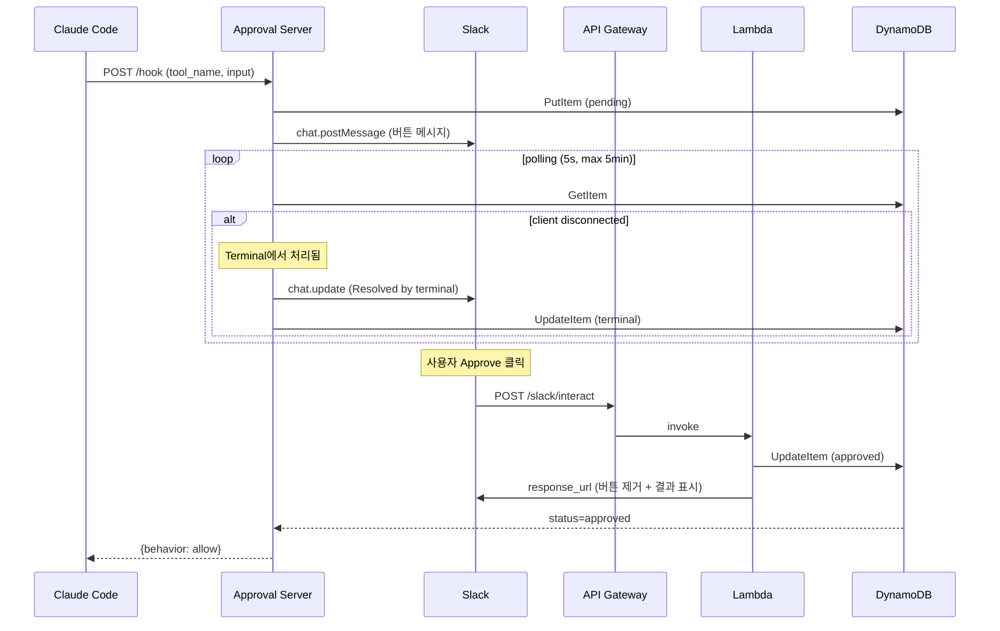

# slack-approval

Claude Code의 권한 요청·선택 질의를 Slack으로 전달하고, Slack 버튼 또는 thread 답글로 응답할 수 있는 시스템.

## 개요

Claude Code 실행 중 파일 쓰기, 명령 실행 등 권한 요청이 발생하면 Slack 메시지로 알림을 받고, 버튼 클릭으로 승인/거부할 수 있다. 자리를 비웠을 때도 Slack에서 진행 중인 작업을 이어갈 수 있도록 다음 기능을 제공한다.



### 주요 기능

| 기능 | 설명 |
|------|------|
| **권한 승인** (PermissionRequest) | 권한 요청을 Slack 카드로 전달. `허용` / `허용 + 다시 안 묻기(규칙)` / `거부` **동적 버튼**. "다시 안 묻기"는 Claude Code가 제안한 `permission_suggestions` 규칙을 그대로 적용. |
| **LLM 요약 카드** | 긴 명령/도구 입력을 Bedrock Claude Haiku로 요약하여 **요청사항 / 영향도·Risk / 확인 필요**를 구조화 표시. 요약 실패 시 원문 표시(fail-open). |
| **선택 질의** (AskUserQuestion) | Claude Code가 사용자에게 객관식을 물을 때, 실제 옵션을 Slack **버튼/체크박스**로 노출하고 선택을 Claude Code로 반환(양방향). |
| **Thread 자유 응답** | 질의 카드의 thread에 자유 텍스트로 답글을 달면, 버튼 대신 그 텍스트가 답으로 전달됨. AskUserQuestion=자유답 주입, PermissionRequest=거부+사유. |
| **터미널/Slack dual-watch** | 터미널·Slack 어느 쪽에서 응답해도 먼저 들어온 것을 채택. 버튼 우선, thread 답글 폴백. |

### PermissionRequest Hook

Claude Code는 [Hooks](https://docs.anthropic.com/en/docs/claude-code/hooks) 시스템을 통해 특정 이벤트 발생 시 외부 명령이나 HTTP 요청을 실행할 수 있다. 그 중 `PermissionRequest` hook은 Claude Code가 사용자 승인이 필요한 동작(파일 편집, Bash 실행 등)을 수행하기 전에 트리거된다.

이 프로젝트는 `PermissionRequest` hook을 HTTP 타입으로 등록하여, 권한 요청을 로컬 서버로 전달하고 Slack을 통해 원격으로 승인/거부할 수 있게 한다.

### Claude Code Settings 구조

Claude Code는 두 단계의 설정 파일을 지원한다:

| 구분 | 파일 경로 | 적용 범위 | Git 추적 |
|------|----------|----------|----------|
| **Global** | `~/.claude/settings.json` | 모든 프로젝트에 적용 | N/A (홈 디렉토리) |
| **Project Local** | `<project-root>/.claude/settings.local.json` | 해당 프로젝트에만 적용 | **제외 권장** (개인 설정) |

> `~`는 현재 사용자의 홈 디렉토리를 의미한다 (macOS: `/Users/<username>`, Linux: `/home/<username>`).

두 파일에 동일한 key가 있으면 **Project Local이 우선**한다.

#### Global 설정 (`~/.claude/settings.json`)

모든 프로젝트에서 Slack Approval을 사용하려면 global 설정에 hook을 등록한다. `install-service.sh` 스크립트가 자동으로 이 설정을 추가한다.

```json
{
  "hooks": {
    "PermissionRequest": [
      {
        "hooks": [
          {
            "type": "http",
            "url": "http://localhost:8080/hook",
            "timeout": 300
          }
        ]
      }
    ]
  }
}
```

#### Project Local 설정 (`.claude/settings.local.json`)

특정 프로젝트에서만 Slack Approval을 사용하려면 프로젝트 루트에 `.claude/settings.local.json`을 생성한다.

```json
{
  "permissions": {
    "allow": [
      "Bash(npm test:*)",
      "Bash(git status:*)"
    ]
  },
  "hooks": {
    "PermissionRequest": [
      {
        "hooks": [
          {
            "type": "http",
            "url": "http://localhost:8080/hook",
            "timeout": 300
          }
        ]
      }
    ]
  }
}
```

**주요 key 설명:**

| Key | 설명 |
|-----|------|
| `permissions.allow` | 자동 허용할 도구/명령 패턴 목록 (이 목록에 매칭되면 hook을 거치지 않고 즉시 허용) |
| `hooks.PermissionRequest` | 권한 요청 시 실행할 hook 배열 |
| `hooks.PermissionRequest[].hooks[].type` | `"http"` — HTTP POST로 hook 호출 |
| `hooks.PermissionRequest[].hooks[].url` | Approval Server 주소 (`http://localhost:8080/hook`) |
| `hooks.PermissionRequest[].hooks[].timeout` | 응답 대기 시간(초). `300` = 5분 |

> **참고**: `settings.local.json`은 개인 환경 설정이므로 `.gitignore`에 포함하여 git에 올리지 않는다.

### Hook 동작 방식

- **PermissionRequest** hook(`/hook`)이 `{"behavior": "allow"}`를 반환하면 승인, `{"behavior": "deny"}`를 반환하면 거부. `허용 + 다시 안 묻기` 선택 시 `permissionRule`을 함께 반환해 규칙을 등록.
- **AskUserQuestion**은 `PreToolUse` hook(`/ask`)이 전담. 옵션을 Slack 버튼으로 띄우고, 응답을 `updatedInput.answers`로 반환. (PermissionRequest hook은 AskUserQuestion이면 즉시 allow하여 중복 카드를 방지.)
- 터미널에서 직접 승인/거부하면 hook 연결이 끊기며, 서버가 이를 감지하여 Slack 메시지를 자동 업데이트.
- **Thread 답글**은 Slack Events API(`/slack/events`)로 수신 → `message_ts` GSI로 해당 카드를 찾아 `free_text`로 기록 → 서버 polling이 회수. bot 자신의 메시지는 무시(무한 루프 방지).

### 엔드포인트 / Slack 앱 요구사항

| 경로 | 용도 | Slack 설정 |
|------|------|-----------|
| `POST /hook` (로컬 :8080) | PermissionRequest hook 수신 | Claude Code hook (http) |
| `POST /ask` (로컬 :8080) | AskUserQuestion hook 수신 | Claude Code PreToolUse hook (http) |
| `POST /slack/interact` (API GW) | 버튼 클릭 | **Interactivity** Request URL |
| `POST /slack/events` (API GW) | thread 답글 | **Event Subscriptions** Request URL + `message.channels`/`message.groups` 구독 |

> Bot Token Scope: `chat:write`(발신), `channels:history`+`groups:history`(thread 답글 수신). thread 자유 응답을 쓰려면 Event Subscriptions 활성화 후 앱 재설치가 필요하다. 비공개 채널은 `message.groups` 구독이 필수.

## 처음부터 배포하기 (Fresh Deployment)

> 현재 **macOS** 환경을 기준으로 작성되었다 (LaunchAgent 기반 서비스 관리). Linux에서는 systemd 등으로 대체 필요.

### 사전 요구사항

| 도구 | 설치 방법 | 확인 명령 |
|------|----------|-----------|
| Python 3.10+ | `brew install python` | `python3 --version` |
| Terraform 1.0+ | `brew install terraform` | `terraform --version` |
| AWS CLI | `brew install awscli` | `aws --version` |
| jq | `brew install jq` | `jq --version` |

AWS credentials가 설정되어 있어야 한다:

```bash
aws configure
# 또는 ~/.aws/credentials에 프로필 설정
```

### Step 1: Slack App 생성

[Slack App 설정 가이드](docs/slack-app-setup-guide.md)의 Step 1~5를 따라 Slack App을 만들고 토큰을 획득합니다.

### Step 2: 환경변수 설정

셸 프로필(예: `~/.zshrc`, `~/.bashrc`)에 다음을 추가한다:

```bash
export SLACK_APPROVAL_BOT_TOKEN="xoxb-..."
export SLACK_APPROVAL_CHANNEL_ID="C..."
export TF_VAR_slack_signing_secret="..."

# AWS 리전 변경 시 (기본값: ap-northeast-2)
# export SLACK_APPROVAL_AWS_REGION="us-east-1"
```

추가 후 `source ~/.zshrc` (또는 해당 셸 프로필)을 실행하여 반영한다.

> AWS 리전 기본값은 `ap-northeast-2` (서울)이다. Terraform(`code/terraform/variables.tf`)과 Approval Server(`code/app/approval_server.py`) 모두 동일한 리전을 바라보므로, 변경 시 양쪽 모두 맞춰야 한다.

### Step 3: 배포

```bash
./code/script/deploy.sh
```

이 스크립트가 자동으로:
1. 필수 도구 및 환경변수 검증
2. AWS 인프라 배포 (Terraform: DynamoDB + Lambda + API Gateway)
3. 로컬 서비스 설치 (Python venv + LaunchAgent + Claude Code hook)
4. API Gateway URL 출력

### Step 4: Slack Interactivity + Event Subscriptions 설정

`deploy.sh` 출력에 표시된 API Gateway URL을 Slack App에 등록한다:

1. **Interactivity & Shortcuts** → Request URL: `<API_GW_URL>/slack/interact` (버튼 클릭)
2. **Event Subscriptions** → Enable Events ON → Request URL: `<API_GW_URL>/slack/events`
   - URL 검증은 lambda가 challenge에 응답해 자동 통과(배포 후).
   - **Subscribe to bot events**: 공개 채널이면 `message.channels`, 비공개 채널이면 `message.groups` 추가
3. **OAuth & Permissions** → Bot Token Scopes에 `channels:history`(+필요시 `groups:history`) 추가 → **앱 재설치**
4. 사용 채널에 bot 초대(`/invite @<bot>`)

> 2~4는 **thread 자유 응답** 기능을 쓸 때만 필요하다. 버튼 승인만 쓸 거면 1번(Interactivity)만으로 충분하다. 자세한 방법은 [Slack App 설정 가이드 - Step 6](docs/slack-app-setup-guide.md#step-6-interactivity-설정) 참고.

### Step 5: 동작 확인

```bash
# 서비스 상태
curl http://localhost:8080/health

# Claude Code 실행 후 권한 요청 시 Slack 메시지 수신 확인
```

### 제거

```bash
./code/script/teardown.sh
```

## 아키텍처



## Workflow



자세한 내용: [docs/architecture.md](docs/architecture.md)

## 폴더 구조

```
slack-approval/
├── README.md
├── docs/
│   ├── architecture.md        # 아키텍처 다이어그램
│   ├── plan.md                # 구현 계획
│   └── slack-app-setup-guide.md # Slack App 설정 가이드
├── code/
│   ├── app/                          # 기본 리전: ap-northeast-2 (환경변수로 변경 가능)
│   │   ├── approval_server.py # 로컬 FastAPI 서버 (/hook, /ask, /notify, polling)
│   │   ├── lambda_handler.py  # AWS Lambda (Slack interact 버튼 + events thread 답글)
│   │   ├── summarizer.py      # Bedrock Haiku 요약 (프롬프트/파서 + 호출)
│   │   ├── perm_buttons.py    # permission_suggestions → 동적 버튼/규칙 (순수)
│   │   ├── ask_blocks.py      # AskUserQuestion → Slack 블록/answers (순수)
│   │   ├── poll_decision.py   # 버튼 vs thread free_text 답 채택 결정 (순수)
│   │   ├── slack_events.py    # Slack Events API 파싱 (순수)
│   │   ├── tests/             # pytest 단위 테스트 (51개)
│   │   ├── requirements.txt   # Python 의존성
│   │   └── .env.example       # 환경변수 템플릿
│   ├── script/
│   │   ├── deploy.sh                # 전체 배포 (prerequisite → Terraform → 서비스 설치)
│   │   ├── teardown.sh              # 전체 제거 (서비스 제거 → Terraform destroy)
│   │   ├── install-service.sh       # 서비스 설치 (venv + LaunchAgent + hook)
│   │   ├── uninstall-service.sh     # 서비스 제거
│   │   └── com.oh-my-cc-agent.plist # LaunchAgent plist 템플릿
│   └── terraform/                    # 기본 리전: ap-northeast-2 (variables.tf에서 변경 가능)
│       ├── main.tf            # DynamoDB + Lambda + API GW
│       ├── variables.tf       # 변수 정의 (aws_region 등)
│       └── outputs.tf         # 출력값
└── parking_lot/               # .gitignore 대상 (git에 올리지 않음)
    └── _security_review/      # 보안 리뷰 결과
```

## 구현 계획

[docs/plan.md](docs/plan.md) 참고.

5단계로 구성:
1. AWS 인프라 (DynamoDB + Lambda + API Gateway)
2. Slack App 설정
3. 로컬 Approval Server 작성
4. Claude Code hook 등록
5. 실행 및 검증

## 서비스 설치 (oh-my-cc-agent)

macOS LaunchAgent로 등록하면 로그인 시 자동 시작, 크래시 시 자동 복구된다.

> `deploy.sh`를 사용한 경우 서비스 설치가 자동으로 포함되므로, 이 섹션은 서비스만 별도로 설치/관리할 때 참고한다.

### 설치

```bash
# 환경변수 설정 (최초 1회, 셸 프로필에 등록 권장)
export SLACK_APPROVAL_BOT_TOKEN="xoxb-..."
export SLACK_APPROVAL_CHANNEL_ID="C..."

# 설치 (venv + LaunchAgent + Claude Code global hook)
./code/script/install-service.sh
```

`install-service.sh`는 `~/.claude/settings.json`에 `PermissionRequest` hook을 자동 등록한다. 특정 프로젝트에서만 사용하려면 위의 [Claude Code Settings 구조](#claude-code-settings-구조) 섹션을 참고하여 `.claude/settings.local.json`에 직접 설정한다.

### 관리 명령

```bash
# 상태 확인
launchctl list | grep oh-my-cc-agent
curl http://localhost:8080/health

# 로그 확인 (macOS 기본 경로: ~/Library/Logs/)
tail -f ~/Library/Logs/oh-my-cc-agent/stderr.log

# 제거
./code/script/uninstall-service.sh
```

## Change Log

| 일시 | 변경사항 |
|------|----------|
| 2026-06-10_13:00 | **Thread 자유 응답**: Slack Events API(`/slack/events`) + `message_ts` GSI로 thread 답글을 free_text로 수신, dual-watch(버튼 우선/free_text 폴백). AskUserQuestion 중복 카드 제거. lambda IAM `dynamodb:Query`+GSI ARN 추가. 라이브 E2E 완료 |
| 2026-06-09_12:00 | **Interactive Choices**: PermissionRequest `허용/허용+다시안묻기/거부` 동적 버튼(permission_suggestions 기반), AskUserQuestion 양방향(`/ask`, 단일=버튼/멀티=체크박스). 단위 테스트 인프라(pytest) |
| 2026-06-08_15:00 | **LLM 요약 카드**: Bedrock Claude Haiku로 요청사항/Risk/확인필요 구조화 요약(fail-open), isMeta 주입·interrupt 마커·`[Image #N]` placeholder 필터, 동기 호출 to_thread 오프로드 |
| 2026-04-15_21:00 | Public repo 배포 준비: .DS_Store 제거, settings.local.json 가이드 추가, 경로 표현 일반화, 문서 개선 |
| 2026-04-13_21:50 | README 다이어그램(Mermaid) + PermissionRequest Hook 설명 + tfsec/bandit 조치 + terminal disconnect 감지 |
| 2026-04-13_11:50 | /slack-notify global skill 추가: 작업 완료 요약을 Slack 채널로 전송하는 /notify 엔드포인트 + skill |
| 2026-04-13_10:40 | 배포 패키징: deploy.sh/teardown.sh + Slack App 설정 가이드 + README 배포 워크스루 + 버튼 클릭 후 메시지 업데이트 수정 |
| 2026-04-12_23:50 | oh-my-cc-agent LaunchAgent 서비스화 + install/uninstall 스크립트 + context 표시 + polling 5초 |
