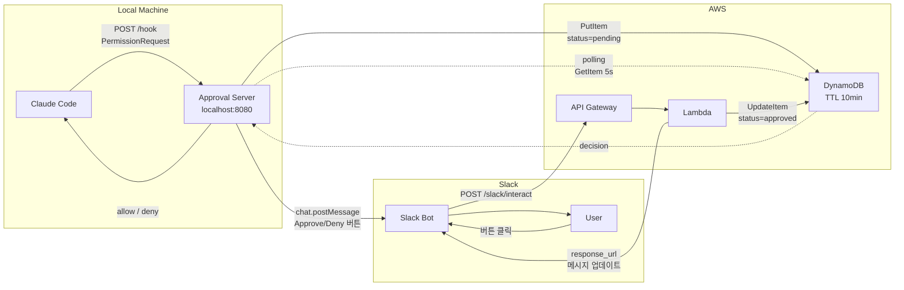
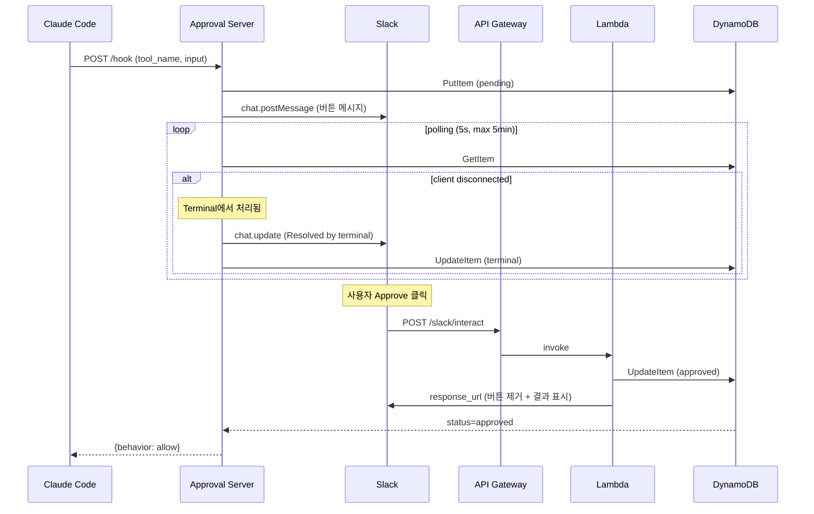

# slack-approval

Claude Code의 권한 요청을 Slack으로 전달하고, Slack에서 Approve/Deny 할 수 있는 시스템.

## 개요

Claude Code 실행 중 파일 쓰기, 명령 실행 등 권한 요청이 발생하면 Slack 메시지로 알림을 받고, 버튼 클릭으로 승인/거부할 수 있다.

### PermissionRequest Hook

Claude Code는 [Hooks](https://docs.anthropic.com/en/docs/claude-code/hooks) 시스템을 통해 특정 이벤트 발생 시 외부 명령이나 HTTP 요청을 실행할 수 있다. 그 중 `PermissionRequest` hook은 Claude Code가 사용자 승인이 필요한 동작(파일 편집, Bash 실행 등)을 수행하기 전에 트리거된다.

이 프로젝트는 `PermissionRequest` hook을 HTTP 타입으로 등록하여, 권한 요청을 로컬 서버로 전달하고 Slack을 통해 원격으로 승인/거부할 수 있게 한다.

**Hook 설정** (`~/.claude/settings.json`):

```json
{
  "hooks": {
    "PermissionRequest": [
      {
        "hooks": [
          {
            "type": "http",
            "url": "http://localhost:8080/hook",
            "timeout": 300
          }
        ]
      }
    ]
  }
}
```

- `type: http` — Claude Code가 권한 요청 시 해당 URL로 POST 요청
- `timeout: 300` — 5분 내 응답이 없으면 timeout
- Hook이 `{"behavior": "allow"}`를 반환하면 승인, `{"behavior": "deny"}`를 반환하면 거부
- 터미널에서 직접 승인/거부하면 hook 연결이 끊기며, 서버가 이를 감지하여 Slack 메시지를 자동 업데이트

## 처음부터 배포하기 (Fresh Deployment)

### 사전 요구사항

| 도구 | 설치 방법 | 확인 명령 |
|------|----------|-----------|
| Python 3.10+ | `brew install python` | `python3 --version` |
| Terraform 1.0+ | `brew install terraform` | `terraform --version` |
| AWS CLI | `brew install awscli` | `aws --version` |
| jq | `brew install jq` | `jq --version` |

AWS credentials가 설정되어 있어야 합니다:

```bash
aws configure
# 또는 ~/.aws/credentials에 프로필 설정
```

### Step 1: Slack App 생성

[Slack App 설정 가이드](docs/slack-app-setup-guide.md)의 Step 1~5를 따라 Slack App을 만들고 토큰을 획득합니다.

### Step 2: 환경변수 설정

```bash
# ~/.zshrc에 추가
export SLACK_APPROVAL_BOT_TOKEN="xoxb-..."
export SLACK_APPROVAL_CHANNEL_ID="C..."
export TF_VAR_slack_signing_secret="..."

source ~/.zshrc
```

### Step 3: 배포

```bash
./code/script/deploy.sh
```

이 스크립트가 자동으로:
1. 필수 도구 및 환경변수 검증
2. AWS 인프라 배포 (Terraform: DynamoDB + Lambda + API Gateway)
3. 로컬 서비스 설치 (Python venv + LaunchAgent + Claude Code hook)
4. API Gateway URL 출력

### Step 4: Slack Interactivity 설정

`deploy.sh` 출력에 표시된 URL을 Slack App의 Interactivity Request URL에 등록합니다.
→ [가이드 Step 6](docs/slack-app-setup-guide.md#step-6-interactivity-설정)

### Step 5: 동작 확인

```bash
# 서비스 상태
curl http://localhost:8080/health

# Claude Code 실행 후 권한 요청 시 Slack 메시지 수신 확인
```

### 제거

```bash
./code/script/teardown.sh
```

## 아키텍처



## Workflow



자세한 내용: [docs/architecture.md](docs/architecture.md)

## 폴더 구조

```
slack-approval/
├── README.md
├── docs/
│   ├── architecture.md        # 아키텍처 다이어그램
│   ├── plan.md                # 구현 계획
│   └── slack-app-setup-guide.md # Slack App 설정 가이드
├── code/
│   ├── app/
│   │   ├── approval_server.py # 로컬 FastAPI 서버
│   │   ├── lambda_handler.py  # AWS Lambda (Slack webhook)
│   │   ├── requirements.txt   # Python 의존성
│   │   └── .env.example       # 환경변수 템플릿
│   ├── script/
│   │   ├── deploy.sh                # 전체 배포 (prerequisite → Terraform → 서비스 설치)
│   │   ├── teardown.sh              # 전체 제거 (서비스 제거 → Terraform destroy)
│   │   ├── install-service.sh       # 서비스 설치 (venv + LaunchAgent + hook)
│   │   ├── uninstall-service.sh     # 서비스 제거
│   │   └── com.oh-my-cc-agent.plist # LaunchAgent plist 템플릿
│   └── terraform/
│       ├── main.tf            # DynamoDB + Lambda + API GW
│       ├── variables.tf       # 변수 정의
│       └── outputs.tf         # 출력값
└── parking_lot/
```

## 구현 계획

[docs/plan.md](docs/plan.md) 참고.

5단계로 구성:
1. AWS 인프라 (DynamoDB + Lambda + API Gateway)
2. Slack App 설정
3. 로컬 Approval Server 작성
4. Claude Code hook 등록
5. 실행 및 검증

## 서비스 설치 (oh-my-cc-agent)

LaunchAgent로 등록하면 Mac 로그인 시 자동 시작, 크래시 시 자동 복구됩니다.

### 설치

```bash
# 환경변수 설정 (최초 1회, ~/.zshrc에 등록 권장)
export SLACK_APPROVAL_BOT_TOKEN="xoxb-..."
export SLACK_APPROVAL_CHANNEL_ID="C..."

# 설치 (venv + LaunchAgent + Claude Code hook)
./code/script/install-service.sh
```

### 관리 명령

```bash
# 상태 확인
launchctl list | grep oh-my-cc-agent
curl http://localhost:8080/health

# 로그 확인
tail -f ~/Library/Logs/oh-my-cc-agent/stderr.log

# 제거
./code/script/uninstall-service.sh
```

## Change Log

| 일시 | 변경사항 |
|------|----------|
| 2026-04-13_21:50 | README 다이어그램(Mermaid) + PermissionRequest Hook 설명 + 보안 리뷰 문서 + tfsec/bandit 조치 + terminal disconnect 감지 |
| 2026-04-13_11:50 | /slack-notify global skill 추가: 작업 완료 요약을 Slack 채널로 전송하는 /notify 엔드포인트 + skill |
| 2026-04-13_10:40 | 배포 패키징: deploy.sh/teardown.sh + Slack App 설정 가이드 + README 배포 워크스루 + 버튼 클릭 후 메시지 업데이트 수정 |
| 2026-04-12_23:50 | oh-my-cc-agent LaunchAgent 서비스화 + install/uninstall 스크립트 + context 표시 + polling 5초 |
| 2026-04-12_20:10 | Phase 1,3 구현 완료: Terraform IaC + Lambda handler + Approval Server + 설정파일 |
| 2026-04-12_19:46 | 아키텍처 다이어그램 및 구현 Plan 작성 완료 |
| 2026-04-12_19:30 | 프로젝트 초기 구조 생성 |
