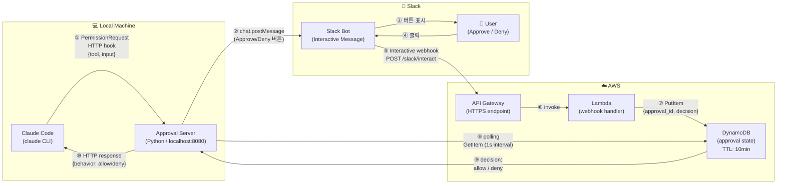
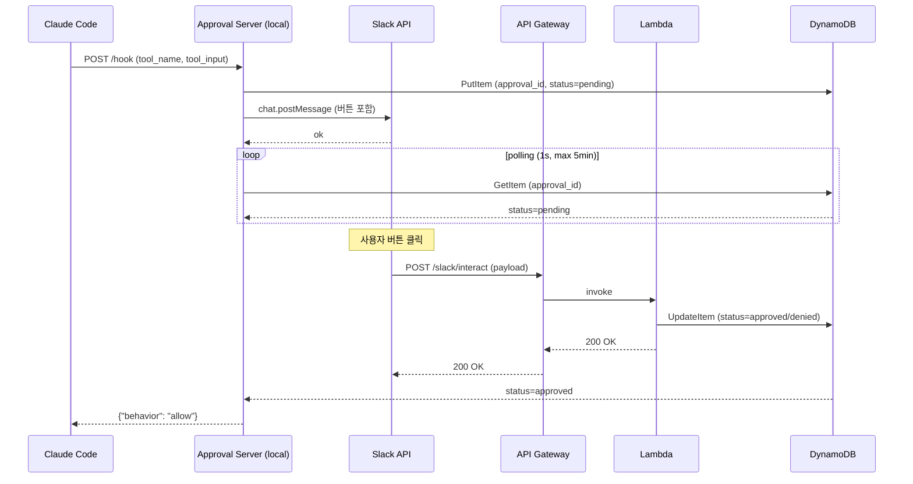

# Architecture Diagram

## 전체 흐름

## 컴포넌트 역할

| 컴포넌트 | 위치 | 역할 |
|---------|------|------|
| Claude Code | Local | PermissionRequest 발생 시 HTTP hook 호출 |
| Approval Server | Local | hook 수신 → Slack 전송 → DDB polling → 결과 반환 |
| API Gateway | AWS | Slack Interactive webhook 수신 (고정 HTTPS URL) |
| Lambda | AWS | webhook payload 파싱 → DDB 저장 |
| DynamoDB | AWS | approval 상태 저장 (TTL 10분 자동 삭제) |
| Slack Bot | Slack | Approve/Deny 버튼 메시지 표시 |

## 시퀀스 상세

